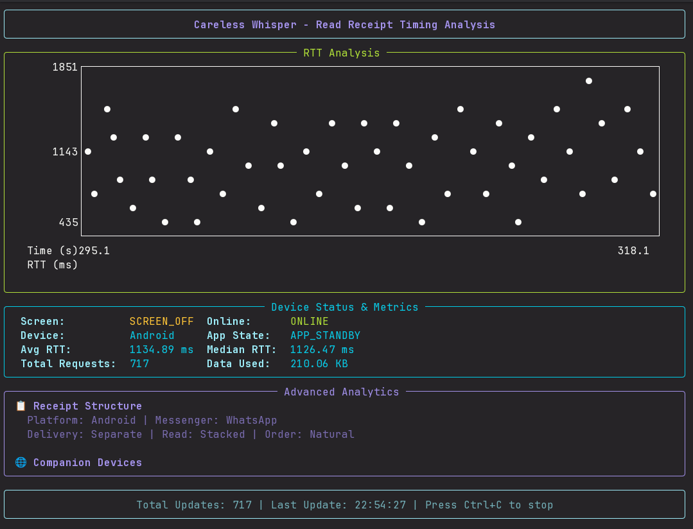
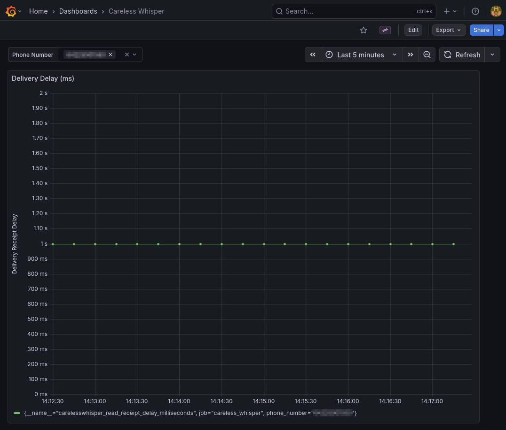

# Careless Whisper - Delivery Receipt Timing Exploit Analyzer

The exploit abuses delivery receipts in end-to-end encrypted messaging applications. Because delivery receipts are generated only after a message is successfully decrypted, their timing can be analyzed to infer user activity—for example, whether a device is online or offline. The attack can be carried out silently, without triggering any visible notifications, because insufficient server-side validation allows an attacker to send “reaction” messages referencing non-existent message IDs within a chat. Using the same mechanism, the attacker can also cause a denial-of-service condition by repeatedly triggering operations that consume device resources such as CPU, battery, and able to drain 13.3 GB per hour of mobile data.

> [!NOTE]
> This repository contains a proof-of-concept implementation of the Careless Whisper attack in Python. It is intended for educational and research purposes only. Please ensure you have permission to test against any target phone numbers and comply with all applicable laws and regulations. All credits for the discovery of this exploit go to the original authors listed in the [Credits section](#credits).

> [!TIP]
> This attack is known to work on WhatsApp and Signal as of December 2025.

## Setup

1. Clone the repository:

    ```sh
    git clone https://github.com/ctrlsam/careless-whisper-python.git
    cd careless-whisper-python
    ```

2. Install the required dependencies:

    ```sh
    pip install .
    ```

## Running the CLI Tool

The CLI tool allows you to interactively run the careless whisper exploit against a target phone number.




#### Fingerprint Command

To run the fingerprinting analysis with an interactive UI, use the following command:

```sh
$ python -m carelesswhisper.tools.cli.main fingerprint --help                                                                                                                                                                                          2 ✘  3.
usage: carelesswhisper fingerprint [-h] --phone-number PHONE_NUMBER [--provider PROVIDER] [--delay DELAY] [--concurrent CONCURRENT] [--exporter EXPORTER] [--metrics] [--metrics-port METRICS_PORT] [--ignore-unregistered]

options:
  -h, --help            show this help message and exit
  --phone-number PHONE_NUMBER, -p PHONE_NUMBER
                        Target phone number for fingerprinting
  --provider PROVIDER   Messenger provider to use (default: whatsapp)
  --delay DELAY         Delay between requests in seconds (default: 1.0)
  --concurrent CONCURRENT
                        Number of concurrent requests (default: 5)
  --exporter EXPORTER   Exporter to use for saving results (e.g., csv)
  --metrics             Enable Prometheus metrics server
  --metrics-port METRICS_PORT
                        Port for the Prometheus metrics server (default: 8000)
  --ignore-unregistered
                        Ignore warning for unregistered phone numbers
``` 


## Supported Messengers

- WhatsApp
- Signal (coming soon)

## Exporters

- CSV
- Prometheus

## Grafana Dashboard

A Grafana dashboard is available for visualizing the delivery receipt delays.
To access the dashboard locally, run:

```sh
docker-compose -f docker/docker-compose.yml up
# Wait for the services to start
# Access Grafana at http://localhost:3000
```



> The default login credentials are `admin` for both username and password.

## Credits

This exploit was discovered by Gabriel Karl Gegenhuber, Maximilian Günther, Markus Maier, Aljosha Judmayer, Florian Holzbauer, Philipp É Frenzel, and Johanna Ullrich in their paper "Careless Whisper: Exploiting Silent Delivery Receipts to Monitor Users on Mobile Instant Messengers" (2025).

```bibtex
@article{gegenhuber2025careless,
  title={Careless Whisper: Exploiting Silent Delivery Receipts to Monitor Users on Mobile Instant Messengers},
  author={Gegenhuber, Gabriel Karl and G{\"u}nther, Maximilian and Maier, Markus and Judmayer, Aljosha and Holzbauer, Florian and Frenzel, Philipp {\'E} and Ullrich, Johanna},
  year={2025}
}
```
